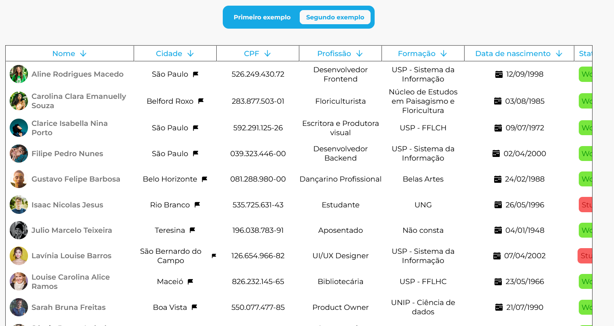

<h1 align="center">React Custom Table</h1>



<br/>
<h3 align="center"> This project was created with the intention of improving the creation of tables and the speed to create them</h3>

<br/>

<ul>
  <a href="#disclaimer"><p>Disclaimer!</p></a>
  <a href="#howWorks"><p>How it works?</p></a>
  <a href="#useIt"><p>How to use?</p></a>
  <a href="#format"><p>Filtered table vs Simple table</p></a>
</ul>

<br />

<h2 id="disclaimer">Disclaimer</h2>

<p>To be able to use this component, the object must have only one level of properties</p>

<div>

```
// correct method:

let data = {
  name: "My name",
  age: 20,
  city: "My city",
  phone: "99999999999"
}
```

```
// wrong method

let data = {
  user: {
    name: "My name",
    age: 20
  },
  city: "My City",
  phone: "99999999999"
};

```

</div>

<h2 id="howWorks">How it works?</h2>

<p>This component is divided into two parts, the self and the line, which is a separate component</p>

<p>Not all properties need to be placed in the Table component, being necessary to add some more properties to be able to filter the table content

<br/>

<h2 id="format">Filtered table VS Simple table</h2>

<p>First of all, we gonna show you how to use a simple Table, without filter method</p>

<h3>Table props</h3>

<br/>

| property      | type        | status   | function                                     | Observation                                                    |
| ------------- | ----------- | -------- | -------------------------------------------- | -------------------------------------------------------------- |
| minWidth      | string      | optional | Just set a minimalWidth table                |                                                                |
| children      | JSX.Element | required | All childrens (rows)                         |                                                                |
| columnsStyle  | string      | required | The component was created with display:grid. | This property must be the same as used when creating child-row |
| columnsValues | IColumn[]   | required | Add your header data, with array of objects  |                                                                |

<h3>Children props</h3>
<br/>

<p>This component it's yours, if you want to create with 3 columns or 12 colunms, go ahead!
<br/>

But... Remeber to use `grid-template-columns` to create the style:

</p>

```

// TableComponent

columnsStyle: "1fr 100px repeat(3, 1fr)";

// Child-row ./style.ts


export default RowChildren = styled.article`

display:grid;
grid-template-columns: "1fr 100px repeat(3, 1fr);

`
```

<h3>columnsValues</h3>

```

export type IColumn = {
  keyName: string;
  name: string;
  mode: "crescent" | "decrescent";
};

```

`keyName` it's the same name with object-key data. `name` it's a label view. You need to pass mode, its a required param. We recommend to initialize all columns with 'crescent' property. `columnsValues` it's a `IColumn[]` array.

<br/>
<h3>Filtered Table</h3>

<p>You need to pass some new props to use filtered Table mode:</p>

```

const [ columns, setColumns ] = useState(yourData);

const [ currentKey, setCurrentKey] = useState(yourData[0].yourFirstKey);


  <Table
    minWidth="900px"
    columnsValues={columns}
    setColumns={setColumns}
    setCurrentKey={setCurrentKey}
    columnsStyle="280px repeat(4, 180px) 240px 100px 280px"
  >
```

<br/>

<h3>Filtered function</h3>

<p>The filter use sort() javascript method to reorder the rows. It's avaliable on <p>

`./src/utils/sortTable.ts`

<p>To use, follow example below</p>

```

<Table
  minWidth="900px"
  columnsValues={customersColumns}
  setColumns={setCustomersColumns}
  setCurrentKey={setCurrentKey}
  columnsStyle="280px repeat(4, 180px) 240px 100px 280px"
    >
      {customersData
        .sort((prev, next) => {
          return sortObjectArray(
            prev,
            next,
            customersColumns,
            currentKey
        );
      })
     .map((user) => (
        <CustomerRow {...(user as any)} />
      ))}
</Table>
```

<br/>

<p>Use sortObjectArray with return of sort callback</p>

<h3><a href="https://github.com/GuiCoelho-S" target="_blank" align="right">Develop by Gui Coelho (frontend developer)</a></h3>
